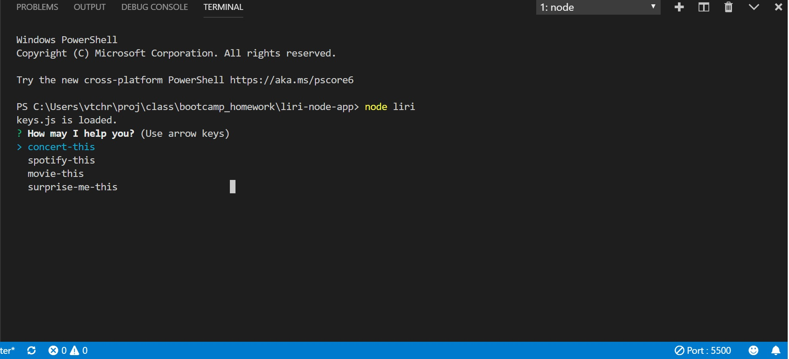
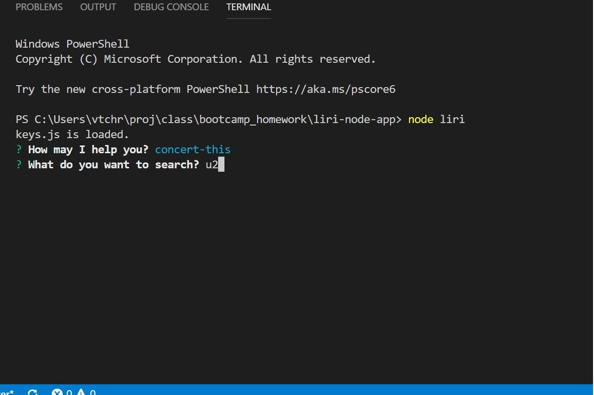
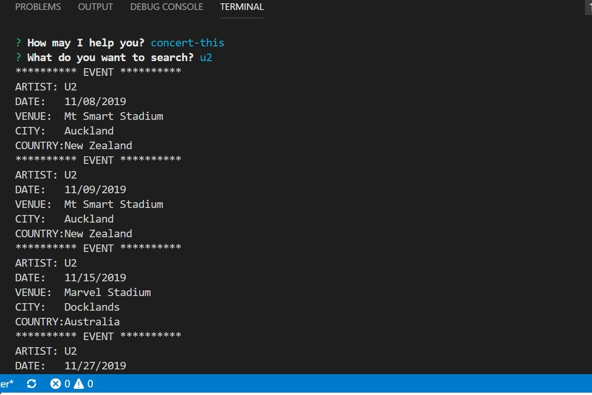
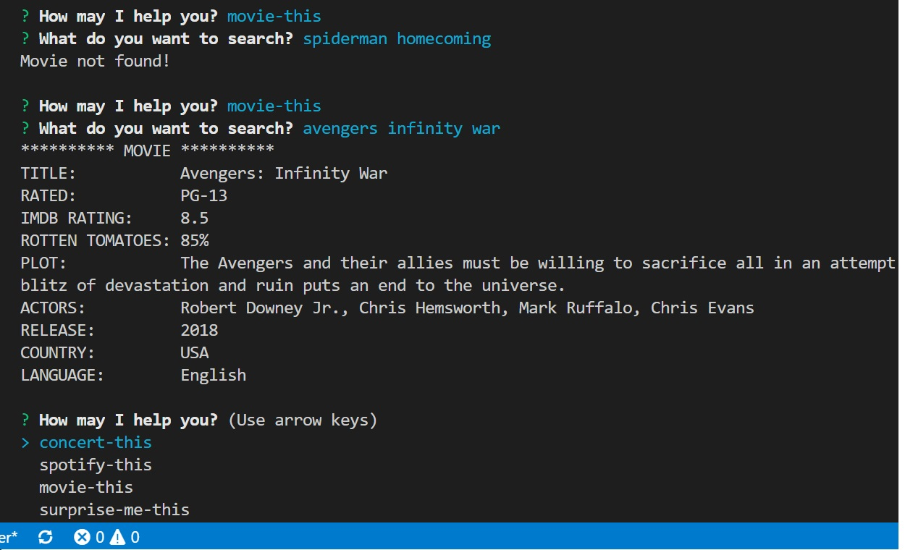
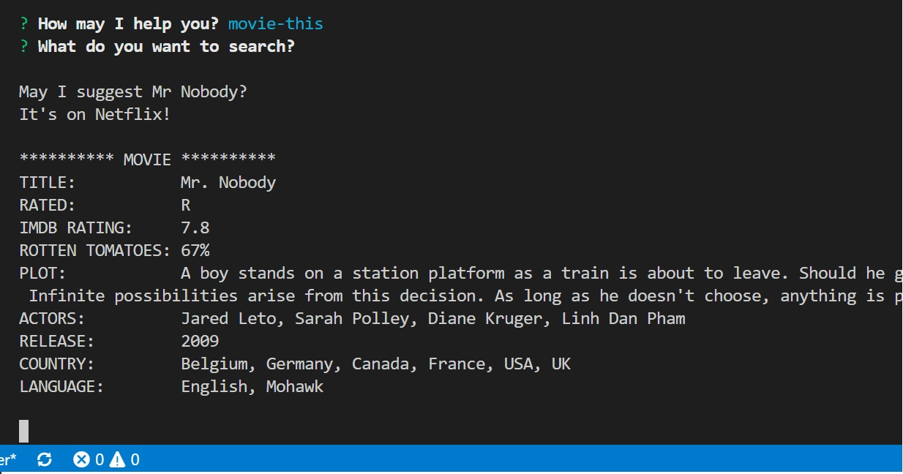
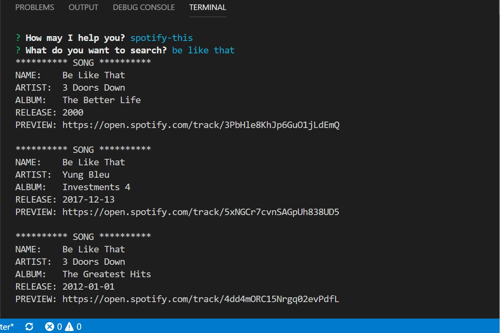
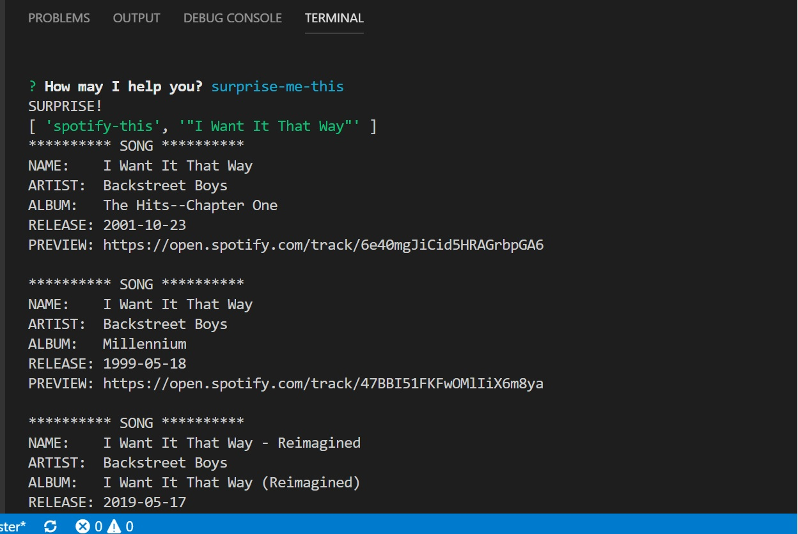
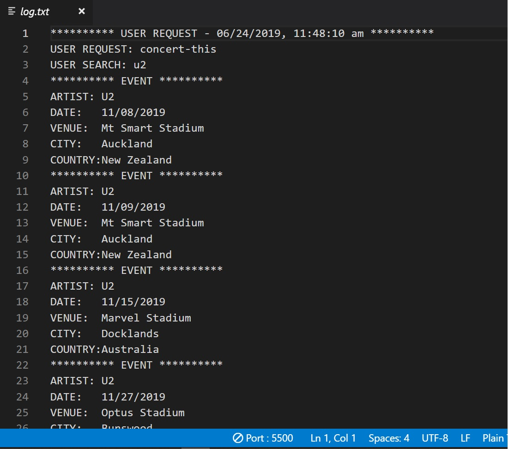

# LIRI-NODE-APP
Language Interpretation and Recognition Interface is a command line app to search Spotify, Bands in Town, and OMDB.

# TECHNOLOGIES
<ul>
    <li>JavaScript</li>
    <li>Nodejs</li>
    <li>Node Packages
        <ul>
            <li>Axios</li>
            <li>DOTEMV</li>
            <li>Inquirer</li>
            <li>Moment</li>
            <li>Node-Spotify-api</li>
        </ul>
    </li>
    <li>APIs
        <ul>
            <li>Bands In Town</li>
            <li>OMDB</li>
            <li>SPOTIFY</li>
        </ul>    
    </li>    
</ul>

# INSTRUCTIONS

Open a command terminal and navigate to the folder containing the liri.js file in it. From here type `node liri` as shown below. 

The menu shown below with be displayed. Use the up-down arrows to select the desired command.

With the exception of surprise-me-this, you will be asked to enter search criteria. In the following example we are searching for concerts (using the Bands In Town API) for the group U2.

