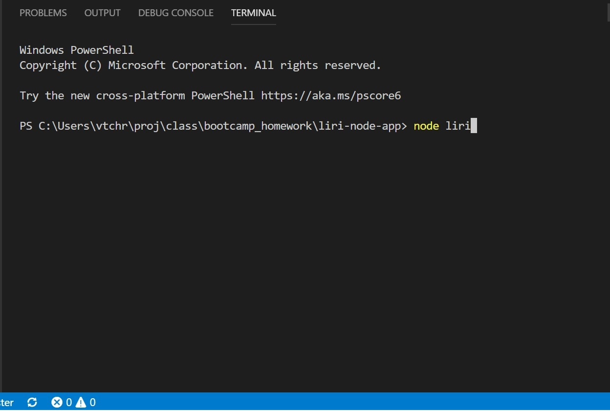

# LIRI-NODE-APP
Language Interpretation and Recognition Interface is a command line app to search Spotify, Bands in Town, and OMDB.

The purpose of this app was to strengthen a variety of skills using Nodejs. 

This includes:
<ul>
    <li>Requiring dependencies.</li>
    <li>Calling APIs outside of the browser.</li>
    <li>storing keys in private files that are not pushed to github.</li>
    <li>Using file readers and writers.</li>
    <li>Using Inquirer for user input.</li>
</ul>

# TECHNOLOGIES
<ul>
    <li>JavaScript</li>
    <li>Nodejs</li>
    <li>Node Packages
        <ul>
            <li>Axios</li>
            <li>DOTEMV</li>
            <li>Inquirer</li>
            <li>Moment</li>
            <li>Node-Spotify-api</li>
        </ul>
    </li>
    <li>APIs
        <ul>
            <li>Bands In Town</li>
            <li>OMDB</li>
            <li>SPOTIFY</li>
        </ul>    
    </li>    
</ul>

# INSTRUCTIONS

Open a command terminal and navigate to the folder containing the liri.js file in it. From here type `node liri` as shown below. 

The menu shown below with be displayed. Use the up-down arrows to select the desired command.

With the exception of surprise-me-this, you will be asked to enter search criteria. In the following example we are searching for concerts (using the Bands In Town API) for the group U2.

The details of the various up-coming concerts will be displayed.

movie-this will display the details of the requested movie.

If a movie is not specified, the app will return the suggestion of "Mr Nobody".

spotify-this will return any song title containing the words provided. Similar to movie-this, if no search words are given, the app will return "The Sign".

surprise-me-this will return details based on the contents of the random.text file. In this case it will run spotify-this for "I Want It That Way".

Last, all requests and outputs are stored to the file log.txt.

